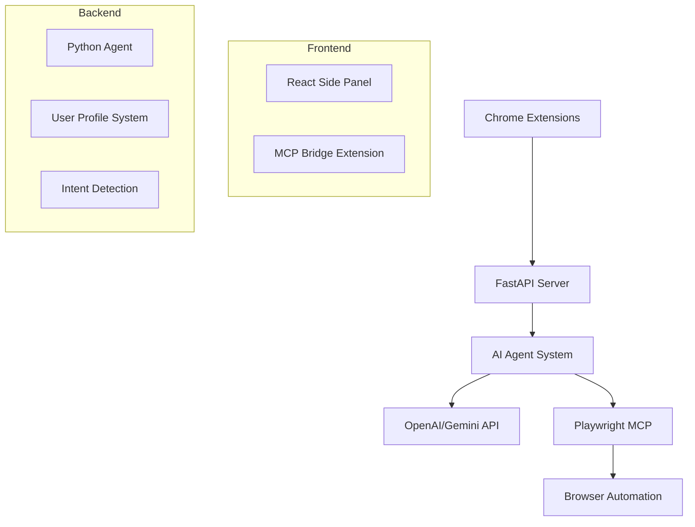

# Multi-Purpose AI Browser Assistant

  

A comprehensive AI-powered browser automation system that combines intelligent web interaction, form auto-filling, and content summarization capabilities. This project consists of multiple Chrome extensions, a Python AI agent backend, and a React-based user interface.

## 🚀 Features

## 📹 Project Demo
- **[Project Demo](https://drive.google.com/file/d/1zFuVKDCoNBCGK4vVTdnwV9x3snyyKc4s/view?usp=sharing)**

### 🤖 AI-Powered Assistance
- **Intelligent Chat Interface**: Direct communication with AI through a side panel
- **Context-Aware Responses**: AI understands current tab context and content
- **Multi-Modal Support**: Handles text, web content, and browser actions

### 🌐 Web Automation (via Playwright MCP Bridge)
- **Smart Form Filling**: Automatically fills web forms using predefined user profiles
- **Web Content Summarization**: Extracts and summarizes webpage content intelligently
- **Browser Tab Integration**: Seamless interaction with active browser tabs
- **Advanced Browser Control**: Deep browser automation through MCP protocol

### 🔧 Browser Extensions
- **Playwright MCP Bridge**: Advanced browser automation and tab sharing (Core Component)
- **React Side Panel**: Modern chat interface for AI interaction
- **Tab Management**: Real-time tab monitoring and selection

### 🛡️ Security & Privacy
- **Local Processing**: All AI operations run locally or through secure APIs
- **Profile-Based Automation**: Secure storage of user information for form filling
- **Controlled Access**: Granular permissions for browser interactions

## 🏗️ Architecture



## 🛠️ Technology Stack

### Frontend
- **React 19.2.0** - Modern UI framework
- **Vite 7.2.2** - Fast build tool and development server
- **Chrome Extension APIs** - Browser integration
- **JavaScript/JSX** - Primary development language

### Backend
- **Python 3.12** - Core backend language
- **FastAPI** - High-performance web API framework
- **OpenAI Agents** - AI agent orchestration
- **Playwright MCP** - Browser automation protocol

### AI & ML
- **OpenAI API** - Language model integration
- **Gemini API** - Alternative AI model support
- **Custom Agent System** - Intelligent task routing
- **Intent Detection** - Natural language understanding

### Development Tools
- **ESLint 9.39.1** - Code linting and formatting
- **Conda** - Python environment management
- **Chrome Developer Tools** - Extension debugging

## 📦 Installation

### Prerequisites
- Node.js 18+ and npm
- Python 3.12+
- Chrome/Chromium browser
- Git
- **Playwright MCP Bridge Extension** (included in this project)

### Backend Setup

1. **Clone the repository:**
```bash
git clone https://github.com/talhazullfiqar/Multi-Purpose-AI-Browser-Assistant.git
cd Multi-Purpose-AI-Browser-Assistant
```

2. **Set up Python environment:**
```bash
cd OPENAI_SDK
conda create -n ai_env python=3.12
conda activate ai_env
pip install -r requirements.txt
```

3. **Configure environment variables:**
```bash
# Create .env file in OPENAI_SDK/src/2_MCP_SERVERS/
GEMINI_API_URL=your_gemini_api_url
GEMINI_API_KEY=your_gemini_api_key
GEMINI_MODEL_NAME=your_model_name
```

4. **Start the FastAPI server:**
```bash
cd src/2_MCP_SERVERS
python server.py
```

### Frontend Setup

1. **Build the React extension:**
```bash
cd my-extension
npm install
npm run build
```

2. **Install Playwright MCP Bridge extension (Required):**
   - Open Chrome and navigate to `chrome://extensions/`
   - Enable "Developer mode"
   - Click "Load unpacked" and select the `mcp/` folder
   - **Important**: This extension must be installed first as it provides the browser automation bridge

3. **Load the React Side Panel extension:**
   - In the same Extensions page, click "Load unpacked" again
   - Select the `my-extension/dist/` folder
   - This provides the chat interface that communicates with the MCP Bridge

## 🎯 Usage

### Basic Chat Interface
1. Click the extension icon to open the side panel
2. Select an active tab from the dropdown
3. Type your question or request
4. Get AI-powered responses with context awareness

### Form Auto-Filling
```
User: "Fill this registration form"
AI: Automatically detects forms and fills with profile data
```

### Web Summarization
```
User: "Summarize this article"
AI: Extracts main content and provides structured summary
```

### Browser Automation
```
User: "Navigate to example.com and click the login button"
AI: Performs automated browser actions via Playwright
```

## 🔧 Configuration

### User Profile Setup
Edit `OPENAI_SDK/src/2_MCP_SERVERS/userProfile.py` to customize:
- Personal information
- Contact details
- Payment information
- Custom preferences

### AI Model Configuration
Modify `agent.py` to adjust:
- Model selection (OpenAI/Gemini)
- System instructions
- Intent detection keywords
- Response behavior

### Extension Permissions
Both extensions require specific permissions:

**Playwright MCP Bridge Extension:**
- `debugger` - Advanced browser control and automation
- `tabs` - Access to browser tabs information
- `activeTab` - Current tab interaction
- `storage` - Local configuration storage
- `<all_urls>` - Universal web access for automation

**React Side Panel Extension:**
- `sidePanel` - Side panel interface access
- `tabs` - Browser tabs management
- `activeTab` - Current tab information
- `scripting` - Content script injection
- `<all_urls>` - Universal web access

**Note**: The Playwright MCP Bridge extension provides the core automation capabilities and must be installed for the system to function properly.

## 🧪 Development

### Local Development
```bash
# Start backend development server
cd OPENAI_SDK/src/2_MCP_SERVERS
python server.py

# Start frontend development server
cd my-extension
npm run dev
```

### Building for Production
```bash
# Build React extension
npm run build

# Package for distribution
# Extensions are ready in dist/ folders
```

### Testing
```bash
# Lint JavaScript code
npm run lint

# Test Python components
python -m pytest tests/
```

## 📋 Project Structure

```
Multi-Purpose-AI-Browser-Assistant/
├── mcp/                          # Playwright MCP Bridge Extension
│   ├── manifest.json             # Extension manifest
│   ├── lib/background.mjs         # Service worker
│   └── lib/ui/                   # UI components
├── my-extension/                 # React Side Panel Extension
│   ├── src/App.jsx               # Main React component
│   ├── public/manifest.json      # Extension manifest
│   └── dist/                     # Built extension
├── OPENAI_SDK/                   # Python AI Backend
│   ├── src/2_MCP_SERVERS/        # Agent system
│   │   ├── agent.py              # Main AI agent
│   │   ├── server.py             # FastAPI server
│   │   └── userProfile.py        # User data
│   └── ai_env/                   # Conda environment
└── README.md                     # This file
```


## 🐛 Known Issues

- Extension requires manual reload after Chrome updates
- Some websites may block automated form filling
- Playwright MCP requires specific Chrome permissions
